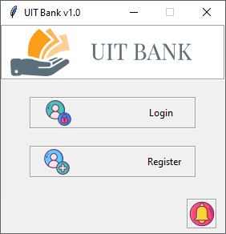

Bank Management System

> Python/Tkinter desktop GUI app to manage customer bank account. This app uses Sqlite3 to store data

## Usage

```bash
# Install dependencies
pipenv install

# Run script
python bank.py


# Compile with Pyinstaller

# Windows
pyinstaller --onefile --windowed part_manager.py

# Mac
pyinstaller --onefile --add-binary='/System/Library/Frameworks/Tk.framework/Tk':'tk' --add-binary='/System/Library/Frameworks/Tcl.framework/Tcl':'tcl' part_manager.py
```

- Version: 1.0.0
- License: MIT
- Author: Hammami Amin
